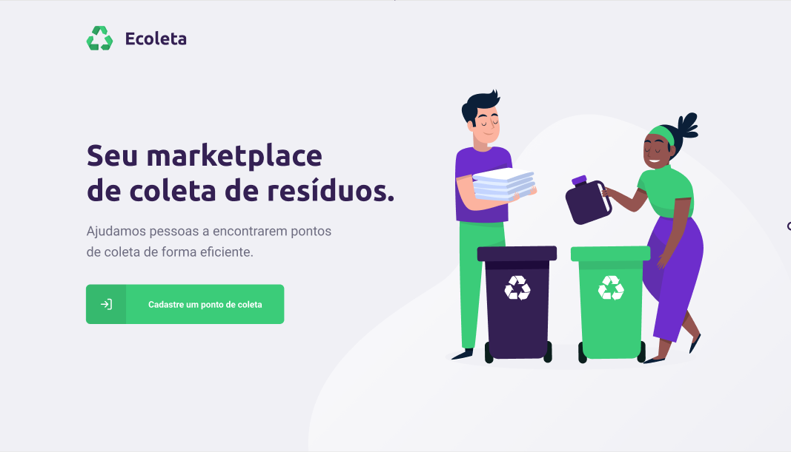
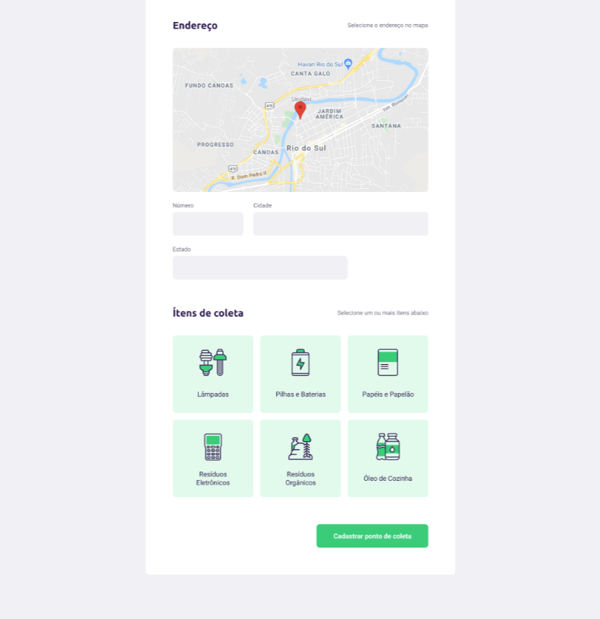
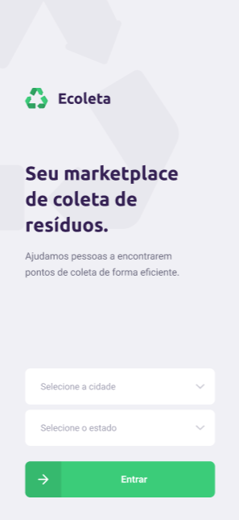
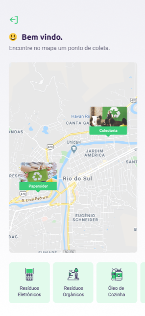
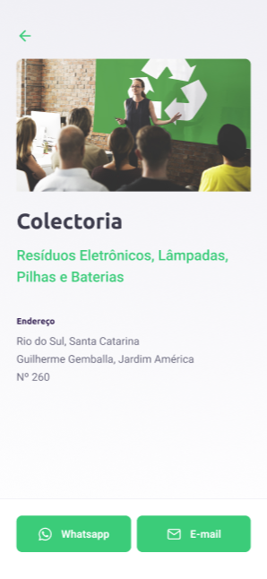

# Ecoleta
[README (pt-BR)](README.md)

Web/mobile application to connect people to recycling points.










## Requirements

- [NodeJS 12.*](https://nodejs.org/en/download/)

## Technologies/Frameworks

- [Typescript](https://www.typescriptlang.org/)
- [React](https://github.com/facebook/react)
- [Express](https://expressjs.com/)
- [React-native](https://reactnative.dev/)
- [Expo](https://expo.io/)
- [Celebrate](https://github.com/arb/celebrate/)
- [Cors](https://github.com/expressjs/cors/)
- [Knex](http://knexjs.org/)
- [Multer](https://github.com/expressjs/multer)
- [Sqlite](https://www.sqlite.org/index.html)
- [Axios](https://github.com/axios/axios)
- [Leaflet](https://leafletjs.com/)

<!-- ## Padrões de projeto

- *Clean Architecture* -->

## How to run the API

This project uses SQLite, to create the database and populate with data, run these commands at the backend folder.
```
npm run knex:migrate
npm run knex:seed
```
Run the API:

```shell script
npm run dev
```
## How to run the React Web app

```
npm run start
```
## How to run the mobile App (React-native)
The Expo framework was used to facilitate the development,
therefore, run the command below to open a web page so that you can connect the app with an emulator or your physical device using USB or QR Code.
```
npm run start
```
## API endpoints

- URL: http://localhost:3333/
- Points: http://localhost:3333/points
- Items: http://localhost:3333/items

Obs: It is also available in this repository the json file to import into [Insomnia](https://insomnia.rest/download/)

## Web endpoints 

- URL: http://localhost:3000/
- Points: http://localhost:3000/create-point