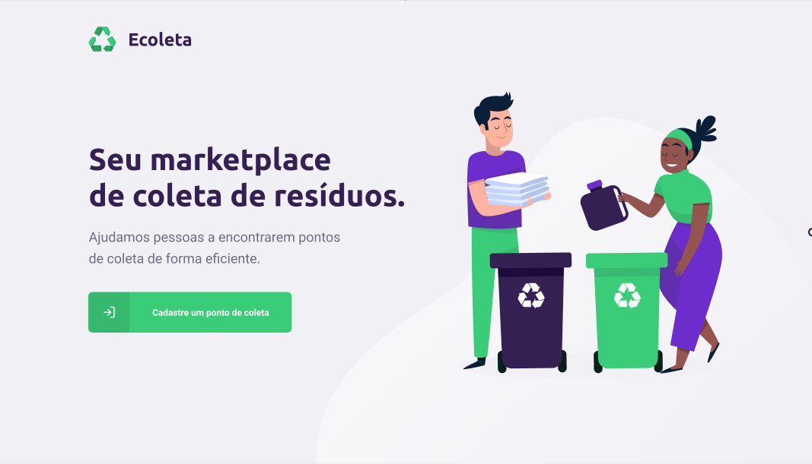
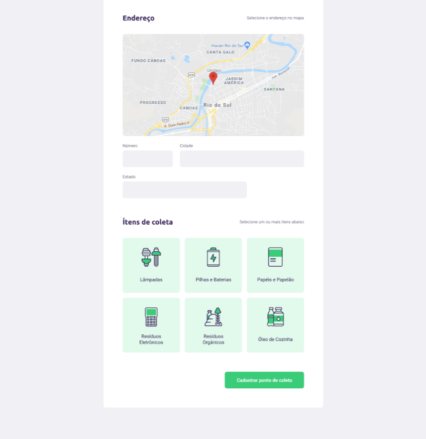

# Ecoleta
[README (en-us)](README-en-us.md)

Aplicação web e mobile para conectar pessoas e pontos de coleta de reciclagem.






## Requisitos

- [NodeJS 12.*](https://nodejs.org/en/download/)

## Tecnologias/Frameworks

- [Typescript](https://www.typescriptlang.org/)
- [React](https://github.com/facebook/react)
- [Express](https://expressjs.com/)
- [React-native](https://reactnative.dev/)
- [Expo](https://expo.io/)
- [Celebrate](https://github.com/arb/celebrate/)
- [Cors](https://github.com/expressjs/cors/)
- [Knex](http://knexjs.org/)
- [Multer](https://github.com/expressjs/multer)
- [Sqlite](https://www.sqlite.org/index.html)
- [Axios](https://github.com/axios/axios)
- [Leaflet](https://leafletjs.com/)

<!-- ## Padrões de projeto

- *Clean Architecture* -->

## Execução API

Esse projeto utiliza SQLite, para criar o banco e popular com seed execute os comandos na pasta backend:
```
npm run knex:migrate
npm run knex:seed
```
Para executar a API:

```shell script
npm run dev
```
## Execução Web

```
npm run start
```
## Execução App (React-native)
Para o react-native foi utilizado o framework Expo, portanto ao executar o comando abaixo sera aberta uma pagina para executar no emulador, dispositivo fisico via cabo ou lendo o QR Code indicado.
```
npm run start
```
## Endpoints API

- URL: http://localhost:3333/
- Points: http://localhost:3333/points
- Items: http://localhost:3333/items

## Endpoints Web

- URL: http://localhost:3000/
- Points: http://localhost:3000/create-point